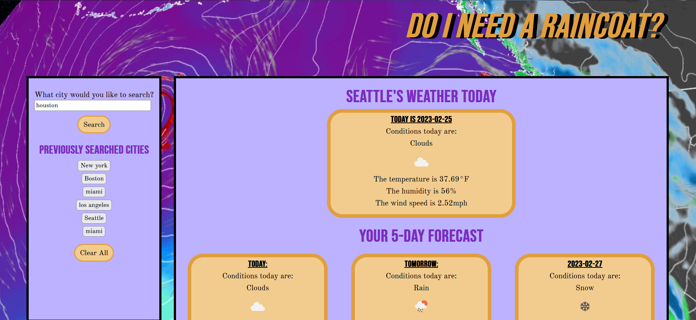

# Do-I-Need-A-Raincoat

[Deployment Link](https://tykervella.github.io/Do-I-Need-A-Raincoat-/)

---

## DESCRIPTION

Weather app to give useful data to the user based on a searched location. The weather for today is displayed at the top of the screen and a 5-day forecast is displayed underneath. 

---

## INSTALLATION 

N/A

---

## USAGE

Upon loading the webpage, the weather forecast for Seattle is displayed. 

However, the user can easily view another location. Under the "What city would you like to search?" form, enter your desired location and press "Search" to see the weather! 

For each city viewed there is a section near the top of the main page for today's weather. Under that, the five day forecast is displayed! The weather information includes the conditions, the temperature, the wind speed and the humidity. 

Previously searched cities will be saved in local storage and displayed in the aside. The user can click on one of the buttons and easily view the weather for that city. If there are too many stored cities, the user can click "Clear All" to empty local storage and start fresh! 

---

## CREDITS 

[Open Weather Map API](https://openweathermap.org/forecast5)

---

## LICENSE 

MIT License 
